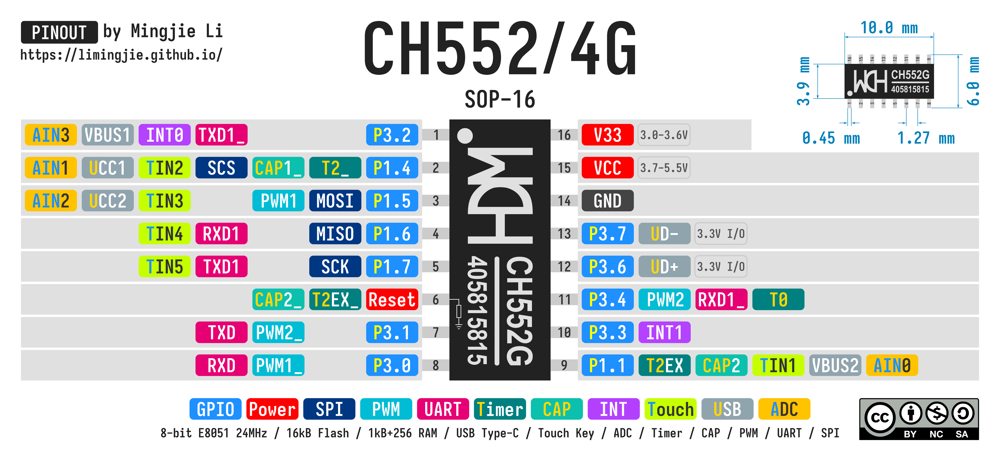
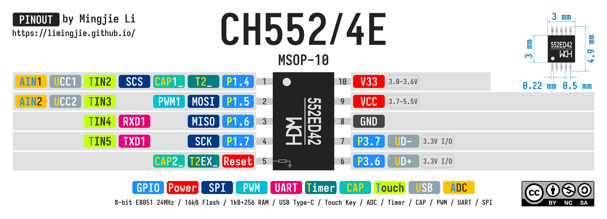

# Minimal CH55x Project

- [Minimal CH55x Project](#minimal-ch55x-project)
  - [Circuit](#circuit)
  - [Run This Minimal Project on macOS](#run-this-minimal-project-on-macos)
  - [CH552/CH554 Pinouts](#ch552ch554-pinouts)
  - [CH55x Documents](#ch55x-documents)
  - [References](#references)
  - [License](#license)

## Circuit


**Notes:**

1. `P3.6` and `P3.7` internally use V33 as I/O power, **so the high level of the input and output can only reach the voltage V33, and 5V is NOT supported**.
2. The USB transceiver is designed built-in based on USB2.0. **The `P3.6` pin and the `P3.7` pin CANNOT be connected to resistors in series when they are used for USB.**

|  No.   | Component                 | Quantity | Notes                                                |
| :----: | ------------------------- | -------: | ---------------------------------------------------- |
| **1**  | CH552T                    |        1 | Other package variants of CH551/2/4 can also be used |
| **2**  | TSSOP-20 Breakout Board   |        1 | 0.65 mm pitch                                        |
| **3**  | USB Type-C Breakout Board |        1 | Requires `D+` and `D-` to upload program to CH552    |
| **4**  | 100 nF Capacitor          |        2 | Ceramic, used as bypass capacitor for MCU            |
| **5**  | 1 kΩ Resistor             |        1 | For LED                                              |
| **6**  | 5.1 kΩ Resistor           |        2 | USB `CC1`/`CC2` pull-down resistor                   |
| **7**  | 10 kΩ Resistor            |        1 | `D+` pull-up resistor                                |
| **8**  | 3 mm Red LED              |        1 |                                                      |
| **9**  | Push Button               |        2 |                                                      |
| **10** | Pin Header                |       24 |                                                      |
| **11** | Breadboard                |        1 |                                                      |
| **12** | Jump Wires                |        - |                                                      |

## Run This Minimal Project on macOS

1. Install `sdcc` and `binutils`.

    ```shell
    brew install sdcc

    # For objcopy
    brew install binutils
    ```

    Add the `binutils` path to your `$PATH` environment variable.

    ```shell
    # macOS arm64
    /opt/homebrew/opt/binutils/bin
    # macOS x86_64
    /usr/local/opt/binutils/bin

    # Z shell - Add the following lines to .zshrc
    if [[ $(uname -m) == 'arm64' ]]; then                  # macOS arm64
        path+=('/opt/homebrew/opt/binutils/bin')           # binutils
    else                                                   # macOS x86_64
        path+=('/usr/local/opt/binutils/bin')              # binutils
    fi
    ```

2. Clone [CH554-Minimal](https://github.com/limingjie/CH554-Minimal.git).

    ```shell
    git clone https://github.com/limingjie/CH554-Minimal.git
    ```

3. Install [CH55x flash tool](https://github.com/MarsTechHAN/ch552tool).

    ```shell
    # Install libusb
    brew install libusb

    # [OPTIONAL] Use Python Virtual Environment
    python3 -m venv .venv
    source .venv/bin/activate

    # Install ch55xtool
    python3 -m pip install ch55xtool
    ```

    Replace `WCHISP` in the `Makefile`:

    ```Makefile
    WCHISP ?= python3 -m ch55xtool -f
    # Or explicitly specify the Python version
    WCHISP ?= python3.11 -m ch55xtool -f
    ```

4. Build and flash the project.

    ```shell
    cd CH554-Minimal
    make
    make flash
    ```

## CH552/CH554 Pinouts





## CH55x Documents

- CH552 Datasheet - [English](./Documents/CH552%20Datasheet%20V1.8%20-%20English.PDF) / [Chinese](./Documents/CH552%20Datasheet%20V1.8%20-%20English.PDF) (Official Website: [English](https://wch-ic.com/downloads/CH552DS1_PDF.html) / [Chinese](https://www.wch.cn/downloads/CH552DS1_PDF.html))
- CH554 Datasheet - [English](./Documents/CH554%20Datasheet%20V1.8%20-%20English.PDF) / [Chinese](./Documents/CH554%20Datasheet%20V2.1%20-%20Chinese.PDF) (Official Website: [English](https://wch-ic.com/downloads/CH554DS1_PDF.html) / [Chinese](https://www.wch.cn/downloads/CH554DS1_PDF.html))
- [CH554 Evaluation Board](./Documents/CH554EVT.ZIP) ([Official Website](https://www.wch.cn/downloads/CH554EVT_ZIP.html))

## References

- [Blink Labs - CH554 SDCC](https://github.com/Blinkinlabs/ch554_sdcc)
- [Stefan Wagner - CH552 USB OLED](https://github.com/wagiminator/CH552-USB-OLED)

## License


This work is licensed under a [Creative Commons Attribution-NonCommercial-ShareAlike 4.0 International License (CC BY-NC-SA 4.0)](https://creativecommons.org/licenses/by-nc-sa/4.0/).

**You are free to:**

- **Share** — copy and redistribute the material in any medium or format
- **Adapt** — remix, transform, and build upon the material

The licensor cannot revoke these freedoms as long as you follow the license terms.

**Under the following terms:**

- **Attribution** - You must give appropriate credit, provide a link to the license, and indicate if changes were made. You may do so in any reasonable manner, but not in any way that suggests the licensor endorses you or your use.
- **NonCommercial** - You may not use the material for commercial purposes.
- **ShareAlike** - If you remix, transform, or build upon the material, you must distribute your contributions under the same license as the original.
- **No additional restrictions** — You may not apply legal terms or technological measures that legally restrict others from doing anything the license permits.

**Notices:**

You do not have to comply with the license for elements of the material in the public domain or where your use is permitted by an applicable exception or limitation.

No warranties are given. The license may not give you all of the permissions necessary for your intended use. For example, other rights such as publicity, privacy, or moral rights may limit how you use the material.
